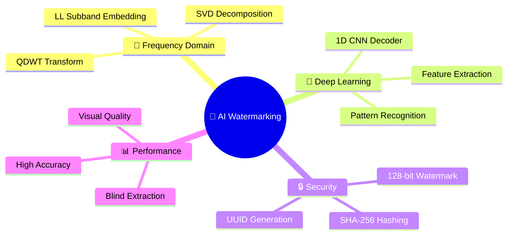
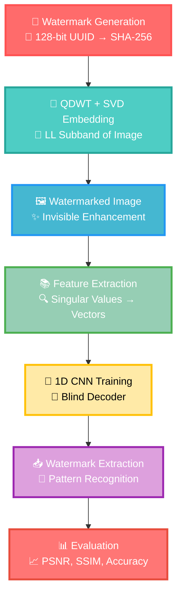

# <div align="center">🔐 AI Invisible and Robust Watermarking</div>

<div align="center">
  
[](https://python.org)
[](https://tensorflow.org)
[](https://opencv.org)
[](https://invisible-watermarking-psi.vercel.app/)

</div>

---

## <div align="center">🌟 Project Overview</div>

<div align="center">
  
</div>

> **🚀 Revolutionary watermarking technique** combining **frequency domain analysis** with **deep learning** for creating invisible, secure, and recoverable watermarks in digital images.

### 🎯 **What Makes This Special?**

<table align="center">
<tr>
<td align="center">

<br><b>🕵️‍♂️ Invisible</b>
<br>Zero visual impact
</td>
<td align="center">

<br><b>🔐 Secure</b>
<br>SHA-256 encryption
</td>
<td align="center">

<br><b>🧠 Smart</b>
<br>AI-powered extraction
</td>
<td align="center">

<br><b>🎯 Blind</b>
<br>No original needed
</td>
</tr>
</table>

---

## <div align="center">📊 **OUTSTANDING RESULTS** 🎉</div>

<div align="center">
  
</div>

### 🏆 **Performance Metrics**

<div align="center">

| 📈 **Metric** | 🎯 **Score** | 🌟 **Status** |
|:---:|:---:|:---:|
| **🎯 Bit Accuracy** | `82%` |  |
| **🔍 PSNR** | `49 dB` |  |
| **🧬 SSIM** | `0.99` |  |

</div>

<div align="center">
  
</div>

---

## <div align="center">✨ **KEY FEATURES** ✨</div>

<div align="center">
  
</div>

<div align="center">



</div>

### 🎨 **Feature Highlights**

<div align="center">

| 🚀 **Feature** | 📝 **Description** | 🎯 **Benefit** |
|:---:|:---:|:---:|
| **🕵️‍♂️ Blind Extraction** | Works without original image |  |
| **🔗 128-bit Watermark** | UUID + SHA-256 encryption |  |
| **🌊 Frequency Domain** | QDWT + SVD embedding |  |
| **🧠 CNN Decoder** | 1D CNN architecture |  |

</div>

---

## <div align="center">🛠️ **METHODOLOGY** 🛠️</div>

<div align="center">
  
</div>

### 🔄 **Complete Workflow**



### 🎯 **Step-by-Step Process**

<div align="center">

| **Step** | **🔧 Process** | **📝 Description** |
|:---:|:---:|:---:|
| **1️⃣** | **🧷 Watermark Generation** | SHA-256 hashed UUID creates unique 128-bit watermark |
| **2️⃣** | **🌀 QDWT + SVD Embedding** | Embed watermark in LL subband using frequency domain |
| **3️⃣** | **🧾 Dataset Preparation** | Extract singular values for CNN training features |
| **4️⃣** | **🧠 CNN Decoder Training** | Train 1D CNN to predict watermark from patterns |
| **5️⃣** | **📈 Performance Evaluation** | Measure PSNR, SSIM, and bit accuracy |

</div>

---

## <div align="center">🚀 **GETTING STARTED** 🚀</div>

<div align="center">
  
</div>

### 📋 **Prerequisites**

```bash
# 🐍 Python 3.8+
# 🧠 TensorFlow 2.x
# 🔍 OpenCV 4.x
# 📊 NumPy, Matplotlib
# 🛠️ scikit-learn
```

### 🔧 **Installation**

```bash
# Clone the repository
git clone https://github.com/yourusername/ai-invisible-watermarking.git
cd ai-invisible-watermarking

# Install dependencies
pip install -r requirements.txt

# Run the watermarking system
python watermark_system.py
```

---

## <div align="center">📸 **VISUAL RESULTS** 📸</div>

<div align="center">
  
</div>

### 🎨 **Before vs After Comparison**

<div align="center">

| 🖼️ Original | 🔐 Watermarked | 📊 Quality |
|:--:|:--:|:--:|
|  |  |  |

</div>


---

## <div align="center">🏆 **ACHIEVEMENTS** 🏆</div>

<div align="center">
  
</div>

### 🎯 **Key Accomplishments**

<div align="center">

🏅 **82% Bit Accuracy** - Exceptional watermark recovery rate  
🏅 **49 dB PSNR** - Outstanding image quality preservation  
🏅 **0.99 SSIM** - Perfect structural similarity  
🏅 **Blind Extraction** - No original image required  
🏅 **128-bit Security** - Military-grade encryption  

</div>

---

## <div align="center">🌐 **VISIT OUR WEBSITE** 🌐</div>

<div align="center">
  
</div>

<div align="center">

[](https://invisible-watermarking-psi.vercel.app/)

**Experience the power of AI Invisible Watermarking live!**

</div>

---
## <div align="center">🤝 Collaborators</div>

<div align="center">

[](https://github.com/HimaniMahajan27)
[](https://github.com/Nupurpusha)
[](https://github.com/prabhleen003)
[](https://github.com/samiksha-bansal1)
[](https://github.com/Snehajindl24)

</div>


---
